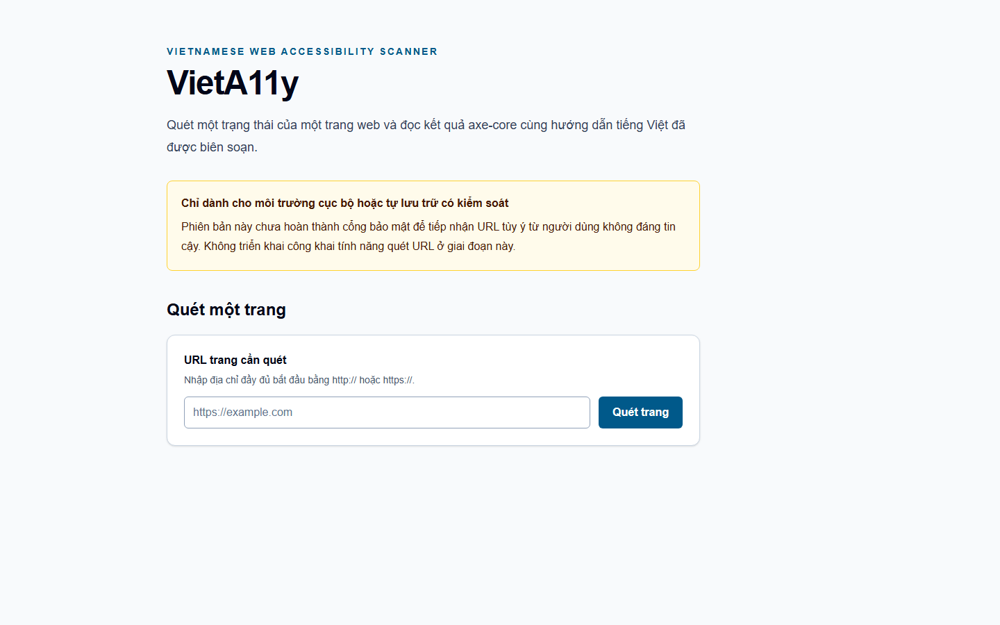
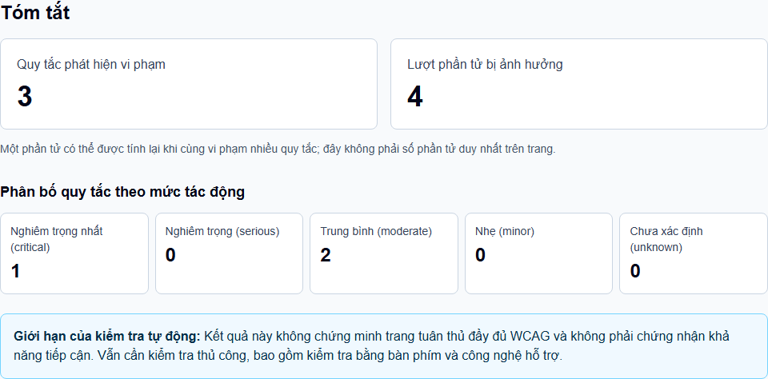
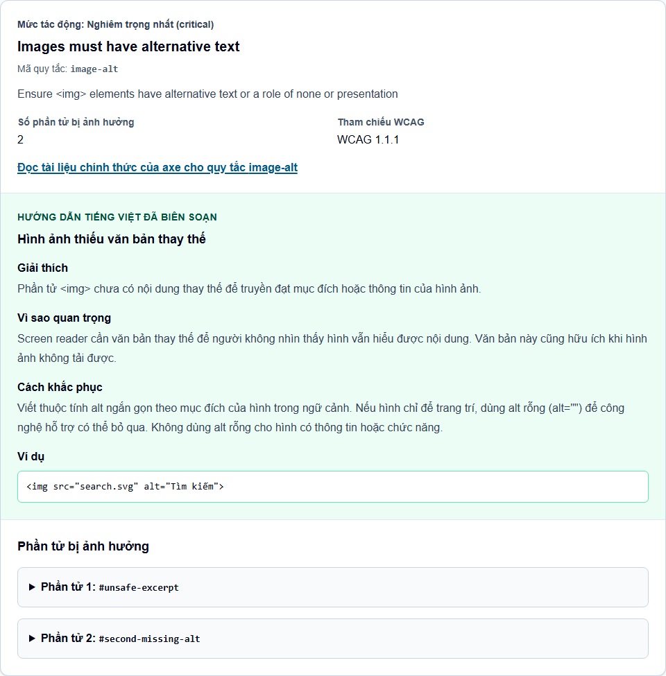

# VietA11y

**Vietnamese Web Accessibility Scanner**

VietA11y scans one captured state of one web page, reports automated
accessibility findings, and adds practical Vietnamese guidance where the
project has a curated entry.

> **Status:** v0.1.0 released on 2026-08-18 · open source under MIT · intended
> for local development and controlled self-hosting



At a glance:

- single-page automated scanning with Playwright and axe-core;
- Vietnamese guidance for 10 curated, high-value axe rules;
- transparent violated-rule, affected-element occurrence, and impact counts;
- every finding remains visible when curated guidance is unavailable; and
- no numeric score or accessibility-certification claim.

Automated testing does **not** prove full WCAG conformance and does not replace
manual testing with keyboards, screen readers, and other assistive technology.

## Quick start

Prerequisites: Node.js 22 or newer and npm 10 or newer.

```sh
npm ci
npm run browser:install --workspace @vieta11y/scanner
npm run dev
```

Open the local URL printed by Next.js. Submit an absolute HTTP or HTTPS URL for
a page you own or are authorized to test.

The application itself runs locally, but the production scanner deliberately
rejects localhost, private, link-local, and other prohibited network targets.
Use a publicly reachable test page whose destination passes the documented
policy; do not weaken that policy to scan a local target.

## Why VietA11y?

Automated tools can identify useful signals, but their rule descriptions are
not always approachable for Vietnamese teams. VietA11y keeps axe-core findings
and authoritative references intact, then supplements selected rules with
original Vietnamese explanations, impact context, and remediation guidance.

The goal is an understandable starting point for accessibility work—not a
compliance score, certification service, or substitute for human review.

## What v0.1.0 can do

- Accept one absolute HTTP or HTTPS URL and scan one captured page state.
- Run axe-core in a fresh, non-persistent Playwright Chromium context.
- Present a serializable report instead of exposing raw axe structures.
- Count violated rules separately from affected-element occurrences. An
  element may be counted again when it violates more than one rule.
- Summarize violated rules by critical, serious, moderate, minor, or unknown
  impact.
- Attach curated Vietnamese guidance to 10 rules and show an honest unavailable
  state for every other rule.
- Bound scan time, concurrent work, and retained report details for controlled
  self-hosting.

## Visual workflow

**Enter URL** → **Scan one page** → **Review automated accessibility findings**
→ **Read curated Vietnamese guidance** → **Follow authoritative references**





Open each finding to inspect its selector, safe HTML excerpt, axe reference, and
Vietnamese guidance when available. Apply fixes in the target project, test
manually as appropriate, and scan the relevant captured state again.

Each scan is synchronous and launches an isolated Chromium context. VietA11y
does not use or inherit your normal browser profile.

## Vietnamese guidance

The initial knowledge layer covers 10 curated axe rules. Entries live in
[`packages/scanner/src/knowledge/rules.vi.ts`](packages/scanner/src/knowledge/rules.vi.ts)
as a small typed record keyed by axe rule ID.

Unsupported rules are never hidden. Their automated findings and authoritative
axe references remain visible with a clear notice that curated Vietnamese
guidance is not yet available. VietA11y does not guess or generate remediation.

To improve an entry or propose a new one, follow the
[Vietnamese guidance workflow](CONTRIBUTING.md#add-or-improve-vietnamese-guidance)
or use the [Vietnamese guidance issue template](.github/ISSUE_TEMPLATE/vietnamese_guidance.yml).

## Current limitations

- A scan covers one captured state of one page; there is no crawling,
  authenticated flow, or scripted multi-state testing.
- Automated findings cannot establish WCAG conformance or replace manual
  accessibility evaluation.
- Only 10 axe rules have curated Vietnamese guidance in v0.1.0.
- Scans are synchronous, with no accounts, history, queue, exports, numeric
  score, or user cancellation.
- Application-level URL and browser guards are defense in depth, not a complete
  SSRF boundary. DNS rebinding and browser/network-stack behavior cannot be
  fully controlled in application code.
- The two-scan capacity limit is per Node.js process, and Chromium still needs
  deployment-level resource and outbound-network controls.
- **Unrestricted public arbitrary-URL hosting is not approved by v0.1.0.**

## Contributing

Bug reports, focused improvements, deterministic tests, accessibility feedback,
and carefully researched Vietnamese knowledge contributions are welcome.

- Browse [Issues](https://github.com/longnt121197/vieta11y/issues) or start with
  the reviewed [Good First Issues](https://github.com/longnt121197/vieta11y/blob/main/.github/GOOD_FIRST_ISSUES.md).
- Read [CONTRIBUTING.md](https://github.com/longnt121197/vieta11y/blob/main/CONTRIBUTING.md)
  for setup, checks, scope, and pull request expectations.
- Use [Discussions](https://github.com/longnt121197/vieta11y/discussions) for
  non-sensitive questions and early ideas.
- Read [SECURITY.md](https://github.com/longnt121197/vieta11y/blob/main/SECURITY.md)
  before self-hosting or reporting a vulnerability.
- Follow the [`CODE_OF_CONDUCT.md`](CODE_OF_CONDUCT.md) in all project spaces.

The repository contains two workspaces:

- `apps/web`: Next.js interface, API boundary, and accessible report UI.
- `packages/scanner`: framework-independent Playwright/axe scanner, report
  normalization, summaries, errors, and Vietnamese guidance lookup.

## Roadmap

Community launch work focuses on contributor onboarding, actionable feedback,
documentation, tests, and the quality of the Vietnamese knowledge layer.
Near-term development should remain small and evidence-driven.

Potential later directions include a broader Vietnamese WCAG knowledge base and
other developer workflows. A CLI, GitHub Action, browser extension, or public
scanner would each require a separate scoped decision; they are not commitments
of v0.1.0. Public arbitrary-URL hosting also requires a separate security gate.

## Security

Read [`SECURITY.md`](SECURITY.md) before self-hosting. It documents the current
controls, remaining SSRF and resource-exhaustion limitations, deployment
expectations, and private vulnerability-reporting process.

Do not post vulnerabilities, secrets, private URLs, or scanned page data in a
public issue. Use [GitHub private vulnerability reporting](https://github.com/longnt121197/vieta11y/security/advisories/new).

## License

[MIT](LICENSE)
